# 連絡帳管理システム 利用マニュアル

## 目次
1. [システム概要](#システム概要)
2. [ログイン方法](#ログイン方法)
3. [生徒向け機能](#生徒向け機能)
4. [担任向け機能](#担任向け機能)
5. [ユーザー管理者向け機能](#ユーザー管理者向け機能)
6. [よくある質問](#よくある質問)

---

## システム概要

連絡帳管理システムは、生徒が日々の体調・メンタル・授業振り返りを記録し、担任が確認・既読処理を行うためのWebアプリケーションです。

※マニュアル画面は課題１時点の仕様となっております。

### 対応ブラウザ
- Microsoft Edge 最新版

### ユーザーロール
| ロール | 役割 |
|--------|------|
| **生徒** | 連絡帳の登録・閲覧 |
| **担任** | 生徒の連絡帳確認・既読処理 |
| **ユーザー管理者** | ユーザー・クラス管理 |

---

## ログイン方法

### 1. ログイン画面にアクセス
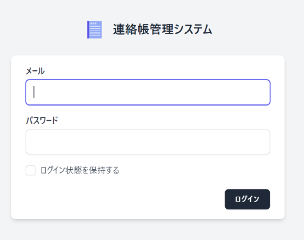

ブラウザで以下のURLにアクセスします：
```
https://[アプリケーションURL]/login
```

### 2. 認証情報を入力
- **メールアドレス**: 配布されたメールアドレスを入力
- **パスワード**: 初期パスワード（管理者から配布）を入力

### 3. ログインボタンをクリック
ロールに応じて自動的にホーム画面にリダイレクトされます。

### パスワードを忘れた場合
パスワードリセットはユーザー管理者のみが実行できます。担当の管理者に連絡してください。

---

## 生徒向け機能

### 3.1 連絡帳の登録
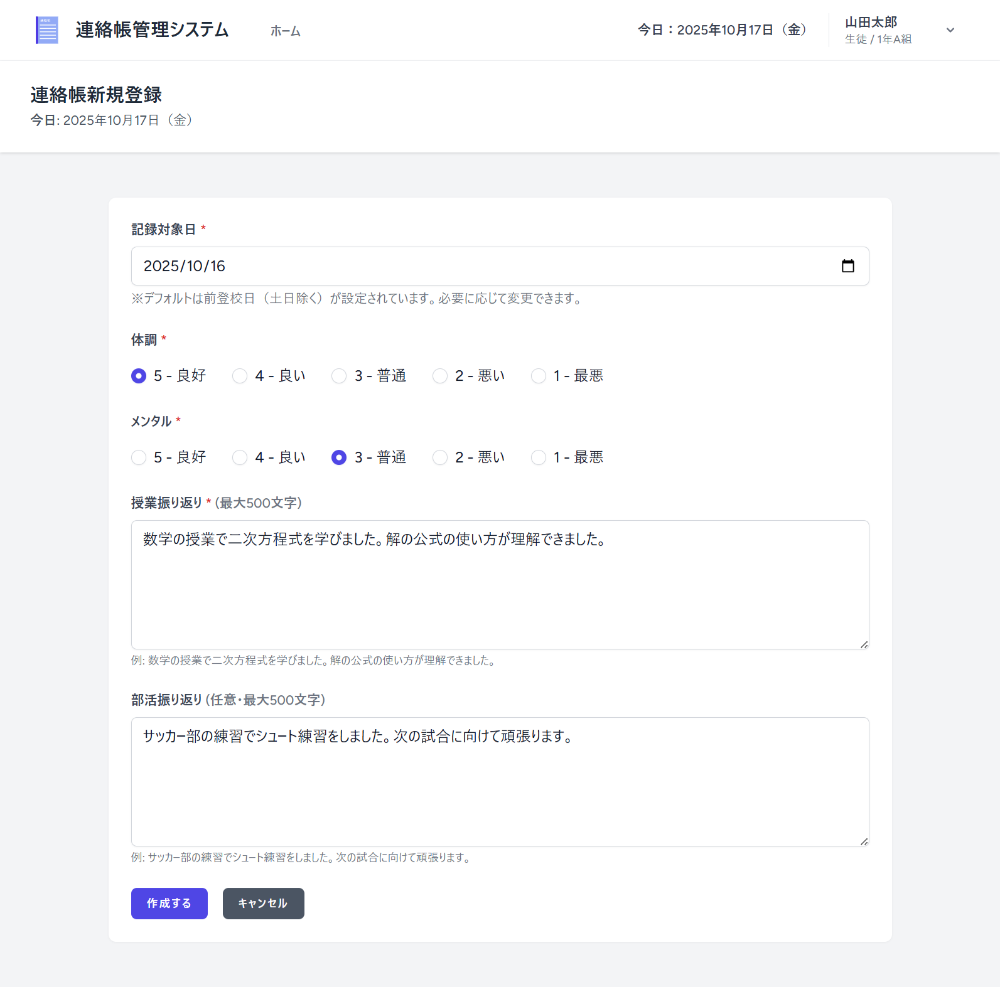

#### 手順
1. **生徒ホーム画面**で「連絡帳を作成」ボタンをクリック
2. **連絡帳登録画面**で以下を入力：
   - **記録対象日**: デフォルトで前登校日が設定されます（変更可能）
   - **体調**: 1〜5段階（1=最悪、5=良好）を選択【必須】
   - **メンタル**: 1〜5段階（1=最悪、5=良好）を選択【必須】
   - **授業振り返り**: 最大500文字【必須】
   - **部活振り返り**: 最大500文字【任意】
3. 「作成する」ボタンをクリック

#### 注意事項
- 同じ記録対象日の連絡帳は1つしか作成できません
- 土日は自動的にスキップされます
- 既読処理後は編集できません

### 3.2 連絡帳の閲覧

#### 生徒ホーム画面
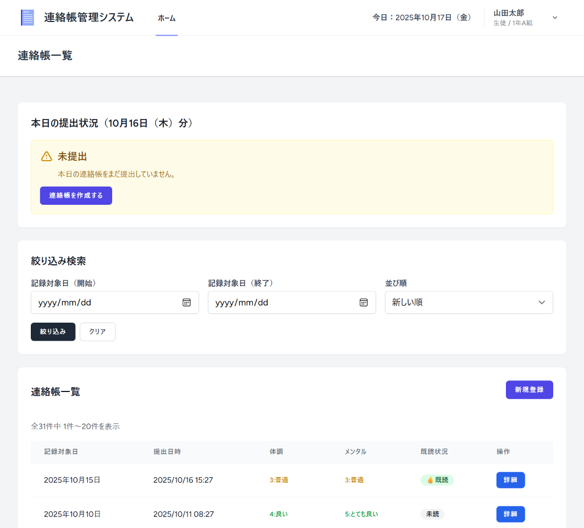
- 自分の連絡帳一覧が表示されます
- 「詳細」ボタンをクリックして内容を確認できます
- 既読済みの場合は「👍既読」マークが表示されます

### 3.3 連絡帳の編集
- 画面は連絡帳登録画面と同じになります。
#### 編集可能な条件
- 未既読の連絡帳のみ編集可能
- 連絡帳詳細画面で「編集」ボタンが表示されます

#### 手順
1. 連絡帳詳細画面で「編集」ボタンをクリック
2. 内容を修正
3. 「更新する」ボタンをクリック

---

## 担任向け機能

### 4.1 提出状況の確認

#### 担任ホーム画面
本日の記録対象日（前登校日）に関する提出状況が表示されます：
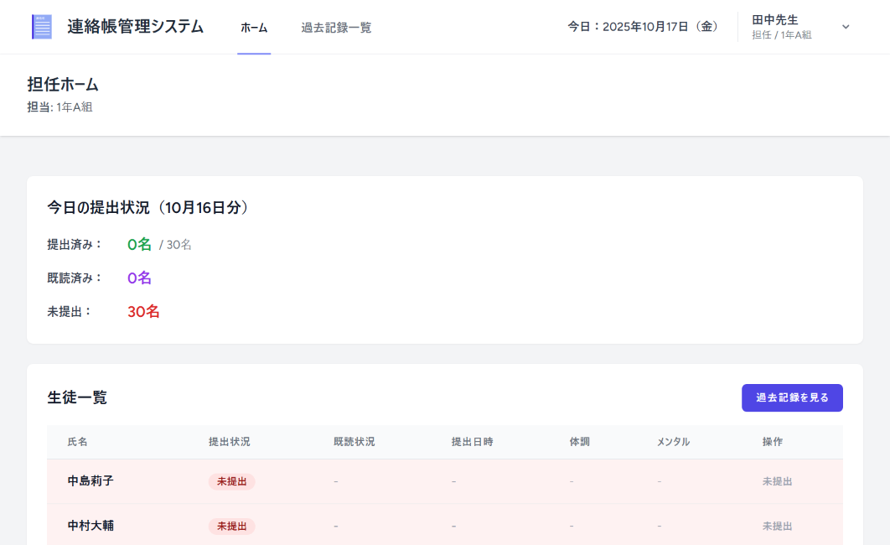
- **提出状況サマリー**:
  - 提出済み人数 / クラス総生徒数
  - 既読処理済み人数
  - 未提出人数
  - 未提出生徒の一覧（赤字で表示）

- **本日の提出状況一覧**:
  - 提出済み生徒の連絡帳一覧
  - 体調・メンタルが低い生徒は赤字で表示
  - 「詳細」ボタンで連絡帳の内容を確認

### 4.2 連絡帳の既読処理
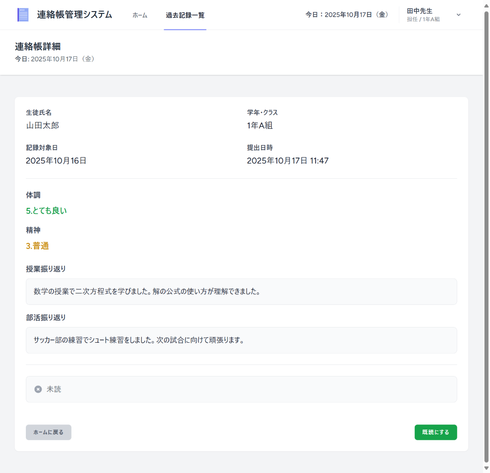
#### 手順
1. 担任ホーム画面で「詳細」ボタンをクリック
2. **連絡帳詳細画面**で内容を確認
3. 「既読にする」ボタンをクリック

#### 既読処理の効果
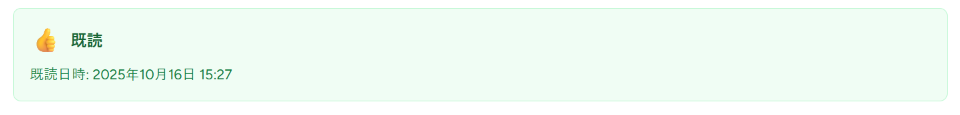
- 「👍既読」マークが表示されます
- 既読日時と既読者が記録されます
- 生徒は編集できなくなります
- **既読処理は取り消しできません**

### 4.3 過去記録の閲覧

#### 過去記録一覧画面
ナビゲーションバーの「過去記録一覧」をクリックします。
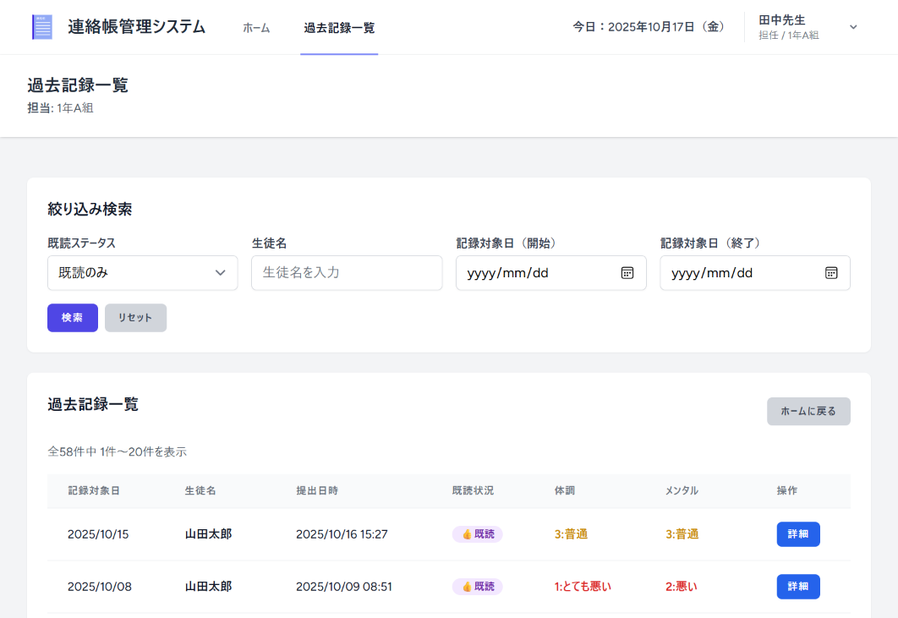
#### 表示内容
- 本日の記録対象日以外の連絡帳
- デフォルトで既読済みの記録のみ表示

#### 絞り込み検索
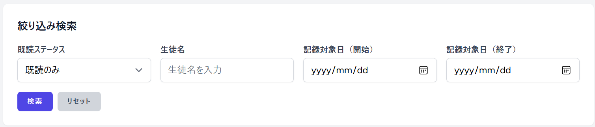
以下の条件で絞り込みが可能です：
- **既読ステータス**: 既読のみ / 未読のみ / 全て
- **生徒名**: 部分一致検索
- **記録対象日（開始日）**: 指定日以降の記録
- **記録対象日（終了日）**: 指定日以前の記録

---

## ユーザー管理者向け機能

### 5.1 ユーザー管理
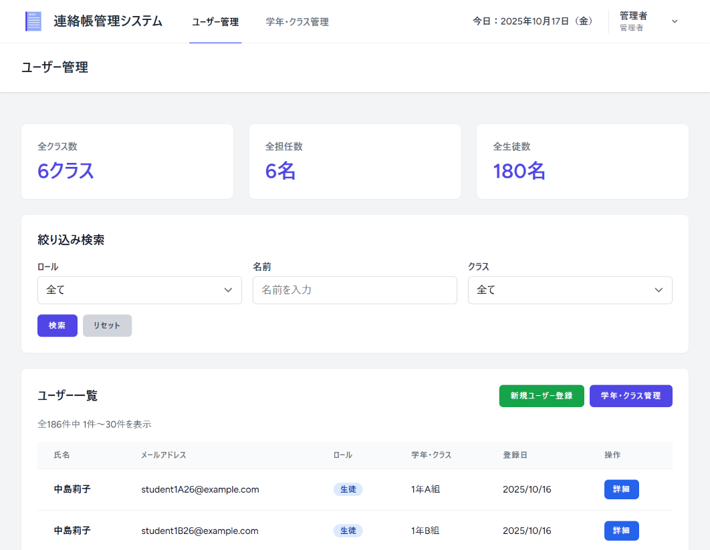
#### ユーザー一覧
- 管理者ホーム画面に全ユーザーが表示されます
- ロール・クラスでフィルタリング可能

#### 新規ユーザー登録
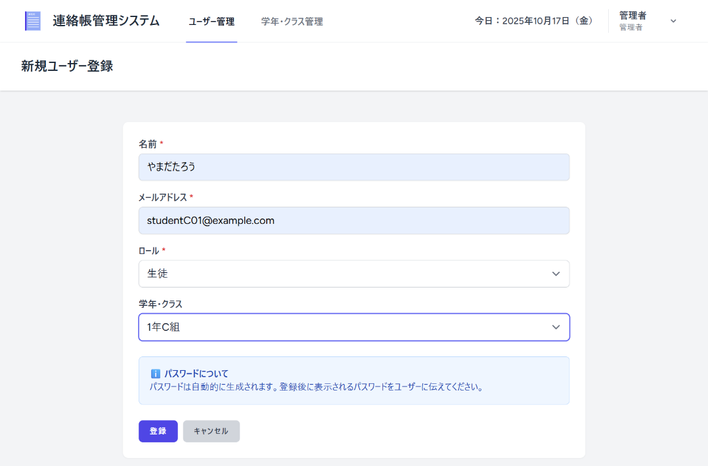
##### 手順
1. 「新規ユーザー作成」ボタンをクリック
2. 以下の情報を入力：
   - **氏名**: 最大50文字【必須】
   - **メールアドレス**: 最大255文字【必須・一意】
   - **役割**: 生徒 / 担任 / 管理者【必須】
   - **クラス**: 生徒・担任の場合のみ【必須】
3. 「登録」ボタンをクリック
4. **初期パスワードが表示されます**（必ずメモしてください）
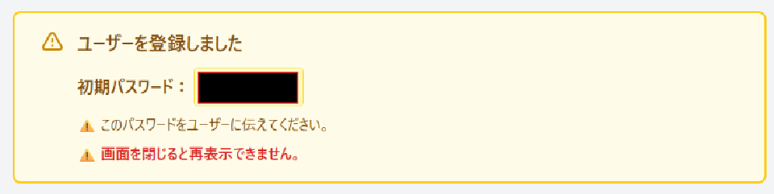

#### ユーザー情報の編集
画面レイアウトは新規ユーザー登録画面と同じになります。
##### 手順
1. ユーザー一覧で「詳細」ボタンをクリック
2. ユーザー詳細画面で「編集」ボタンをクリック
3. 情報を修正
4. 「更新」ボタンをクリック

#### パスワードリセット
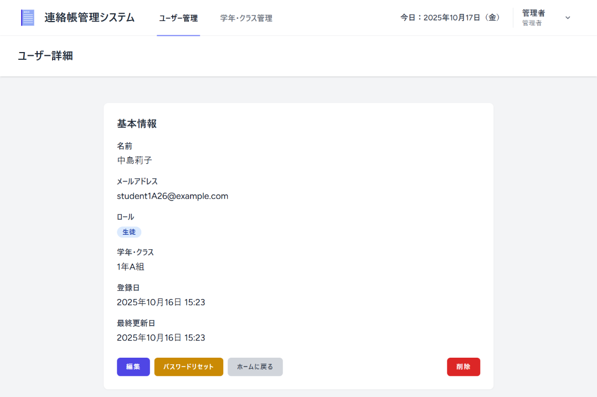
##### 手順
1. ユーザー詳細画面で「パスワードリセット」ボタンをクリック
2. 確認ダイアログで「OK」をクリック
3. **新しいパスワードが表示されます**（必ずメモしてください）

### 5.2 クラス管理

#### クラス一覧
ナビゲーションバーの「学年・クラス管理」をクリックします。
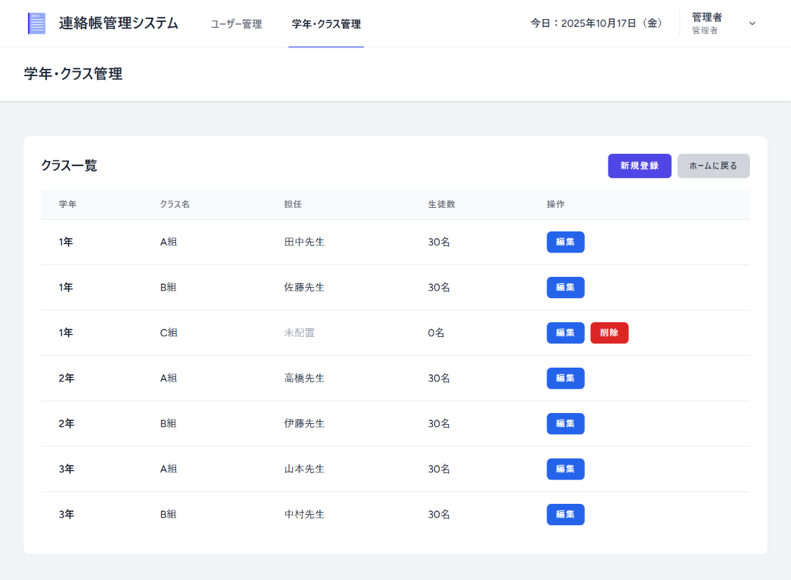
#### 新規クラス作成
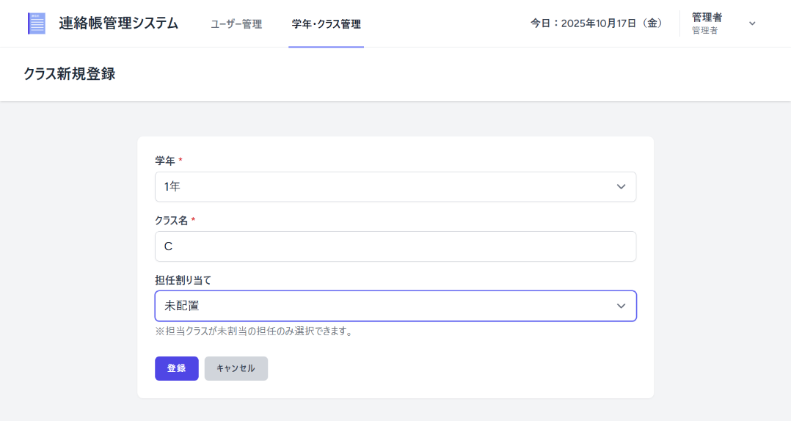
##### 手順
1. 「新規クラス作成」ボタンをクリック
2. 以下の情報を入力：
   - **学年**: 1〜3年【必須】
   - **クラス名**: A、B等【必須】
3. 「作成」ボタンをクリック

#### クラス削除

##### 注意事項
- 所属生徒・担任がいるクラスは削除できません
- 削除前に所属ユーザーを他クラスに移動してください

---

## よくある質問

### Q1. パスワードを忘れました
**A**: ユーザー管理者に連絡してパスワードリセットを依頼してください。

### Q2. 連絡帳を編集できません
**A**: 担任が既読処理をした連絡帳は編集できません。

### Q3. 同じ日付の連絡帳を複数作成できますか？
**A**: できません。1つの記録対象日に対して1つの連絡帳のみ登録可能です。

### Q4. 土日の連絡帳はどうなりますか？
**A**: 土日は自動的にスキップされ、前登校日の日付が自動で選択されます。月曜日に提出する場合、金曜日の内容を記録します。

### Q5. 既読処理を取り消せますか？
**A**: 既読処理は取り消しできません（PoC仕様）。

### Q6. 体調・メンタルの数値の意味は？
**A**: 以下の通りです：
- **5**: とても良い
- **4**: 良い
- **3**: 普通
- **2**: 悪い
- **1**: とても悪い

### Q7. ユーザーを削除できますか？
**A**: ユーザー管理者のみ削除できます。
