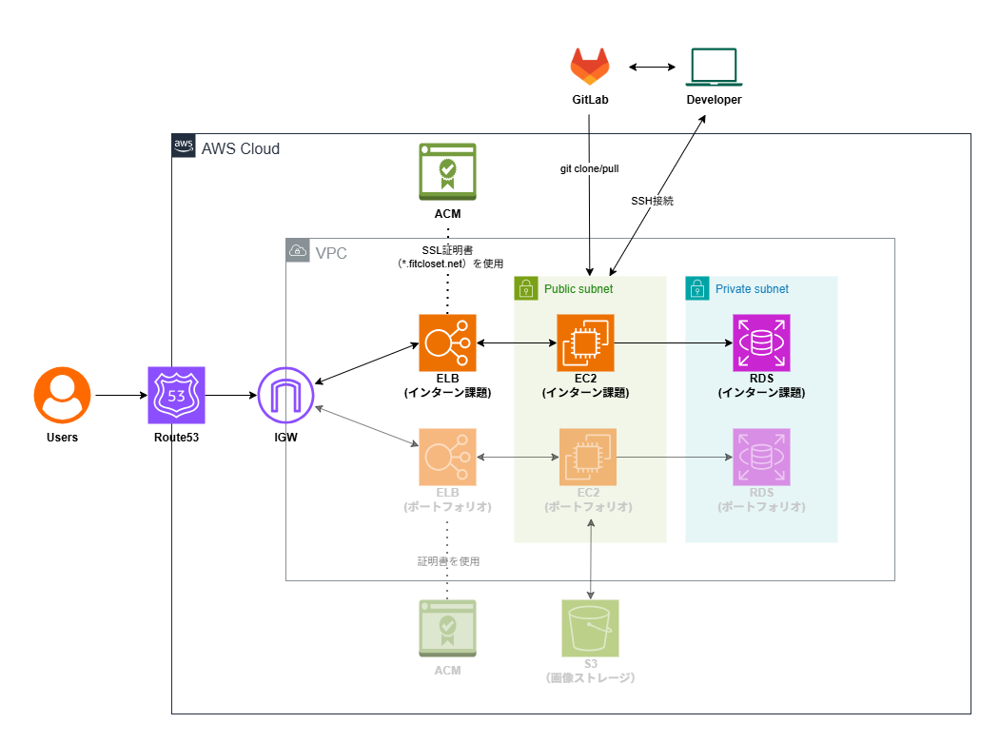

# 連絡帳管理システム デプロイ情報

## 目次
1. [アプリケーション情報](#1-アプリケーション情報)
2. [技術スタック](#2-技術スタック)
3. [インフラ構成](#3-インフラ構成)
4. [セキュリティ対策](#4-セキュリティ対策)

---

## 1. アプリケーション情報

### 1.1 デプロイ先URL
```
https://jpt-intern-app.fitcloset.net
```

### 1.2 動作確認用アカウント
[テストアカウント一覧](Test_Account.md)を参照ください。

---

## 2. 技術スタック

### 2.1 アプリケーション

| カテゴリ | 技術・バージョン |
|---------|----------------|
| **フレームワーク** | Laravel 10.x |
| **言語** | PHP 8.3 |
| **データベース** | MySQL 8.4 |
| **Webサーバー** | Apache 2.4 |
| **OS** | Amazon Linux 2023 |


### 2.2 開発・運用

| カテゴリ | 技術 |
|---------|------|
| **バージョン管理** | Git / GitLab |
| **インフラ** | AWS (EC2, RDS, ALB, Route53, ACM) |
| **デプロイ** | SSH経由でgit clone/pull |

---

## 3. インフラ構成

### 3.1 概要

本アプリケーションは、既存のポートフォリオ用AWS環境の一部リソースを共用しながら、新規リソースを追加して構築しました。

**既存リソース（共用）**
- VPC
- Public Subnet
- Private Subnet
- Internet Gateway
- Route53 Hosted Zone (fitcloset.net)

**新規作成リソース**
- EC2インスタンス（既存EC2のAMIから作成）
- RDS MySQL
- Application Load Balancer
- セキュリティグループ（3つ）
- ACM証明書（ワイルドカード）

---

### 3.2 AWS構成図

#### システム構成フロー
```
インターネット
    ↓
Route53 (jpt-intern-app.fitcloset.net)
    ↓
Application Load Balancer
  ├─ SSL/TLS終端 (*.fitcloset.net)
  ├─ HTTP (80) → HTTPS (443) リダイレクト
  └─ ヘルスチェック (/, 成功コード: 200, 302)
    ↓
EC2 (Public Subnet)
  ├─ Apache 2.4 + PHP 8.3
  └─ Laravel 10
    ↓
RDS MySQL 8.4 (Private Subnet)
  └─ データベース: jpt_intern_app
```

#### 詳細構成図



**構成図の説明**
- **Route53**: DNSによる名前解決
- **ALB**: SSL/TLS終端、HTTPS化、ヘルスチェック
- **EC2**: Webアプリケーションサーバー（Public Subnet）
- **RDS**: データベースサーバー（Private Subnet、外部アクセス不可）
- **ACM**: SSL/TLS証明書管理（自動更新）

---

### 3.3 リソース詳細

#### ネットワーク

| リソース | 説明 | 状態 |
|---------|------|------|
| **VPC** | 仮想プライベートクラウド | 既存（共用） |
| **Public Subnet** | EC2配置用サブネット | 既存（共用） |
| **Private Subnet** | RDS配置用サブネット | 既存（共用） |
| **Internet Gateway** | インターネット接続 | 既存（共用） |

---

#### コンピューティング

| リソース | スペック | 状態 |
|---------|---------|------|
| **EC2** | t2.micro | 新規作成 |
| └ OS | Amazon Linux 2023 | - |
| └ AMI | 既存EC2のカスタムAMI | - |
| └ ストレージ | 8GB gp3 | - |
| └ Apache | 2.4 | - |
| └ PHP | 8.3 | - |
| └ Composer | 最新版 | - |

---

#### データベース

| リソース | スペック | 状態 |
|---------|---------|------|
| **RDS MySQL** | db.t3.micro | 新規作成 |
| └ エンジンバージョン | MySQL 8.4 | - |
| └ ストレージ | 20GB gp3 | - |
| └ 配置 | Private Subnet | - |
| └ パブリックアクセス | 無効 | EC2からのみアクセス可 |
| └ データベース名 | jpt_intern_app | - |
| └ 文字コード | utf8mb4 | - |
| └ バックアップ | 自動（7日間保持） | - |

---

#### ロードバランサー

| リソース | 設定 | 状態 |
|---------|------|------|
| **ALB** | Application Load Balancer | 新規作成 |
| └ スキーム | Internet-facing | - |
| └ リスナー (HTTP) | 80 → 443 リダイレクト | - |
| └ リスナー (HTTPS) | 443 → EC2 (80) | - |
| └ ターゲットグループ | jpt-intern-app-ec2-tg | - |
| └ ヘルスチェックパス | `/` | - |
| └ 成功コード | 200, 302 | - |
| └ ヘルスチェック間隔 | 30秒 | - |

**ヘルスチェック成功コードについて**  
`302` を含める理由: Laravelのルートパス `/` は認証が必要なため、未認証ユーザーを `/login` にリダイレクト（HTTP 302）します。これは正常な動作であるため、ヘルスチェックの成功コードに含めています。

---

#### セキュリティグループ

| 名前 | 用途 | インバウンドルール | 状態 |
|------|------|------------------|------|
| **jpt-intern-app-elb-sg** | ELB用 | HTTP (80): 0.0.0.0/0<br>HTTPS (443): 0.0.0.0/0 | 新規作成 |
| **jpt-intern-app-ec2-sg** | EC2用 | HTTP (80): ELBのSGから<br>SSH (22): 管理者IPのみ | 新規作成 |
| **jpt-intern-app-rds-sg** | RDS用 | MySQL (3306): EC2のSGから | 新規作成 |

**セキュリティ設計のポイント**
- ELBは全インターネットからHTTP/HTTPSを受け付け
- EC2はELBからのHTTPのみ受け付け（直接アクセス不可）
- RDSはEC2からのMySQLのみ受け付け（外部アクセス不可）
- SSH接続は管理者IPのみに制限

---

#### SSL/TLS証明書

| リソース | 設定 | 状態 |
|---------|------|------|
| **ACM証明書** | *.fitcloset.net | 新規作成 |
| └ 証明書タイプ | ワイルドカード | - |
| └ 検証方法 | DNS検証（Route53） | - |
| └ 自動更新 | 有効 | - |
| └ 対象ドメイン | *.fitcloset.net<br>fitcloset.net | - |

**ワイルドカード証明書の利点**
- 複数のサブドメインで同一証明書を使用可能
- 証明書管理の簡素化
- 自動更新により運用負荷を軽減

---

#### DNS

| リソース | 設定 | 状態 |
|---------|------|------|
| **Route53** | Hosted Zone: fitcloset.net | 既存（共用） |
| └ レコードタイプ | A（エイリアス） | - |
| └ レコード名 | jpt-intern-app.fitcloset.net | 新規作成 |
| └ ルーティング先 | ALB | - |

---

## 4. セキュリティ対策

### 4.1 実装済みセキュリティ機能

| カテゴリ | 対策内容 | 実装方法 |
|---------|---------|---------|
| **通信暗号化** | 全通信のHTTPS化 | ACM証明書 + ALBでのSSL終端 |
| **データベース保護** | 外部アクセス遮断 | Private Subnet配置 + SGで制限 |
| **アクセス制御** | 最小権限の原則 | セキュリティグループによる厳密な制御 |
| **本番環境設定** | デバッグ情報の非表示 | APP_DEBUG=false |

### 4.2 ネットワークセキュリティ
```
インターネット → ELB → EC2 → RDS
              ↓       ↓       ↓
            HTTPS    HTTP   MySQL
            (443)    (80)   (3306)
              ↓       ↓       ↓
            全開放   ELBのみ EC2のみ
```

**セキュリティの階層化**
1. **第1層（ELB）**: SSL/TLS終端
2. **第2層（EC2）**: ELBからのみアクセス可能
3. **第3層（RDS）**: EC2からのみアクセス可能

---

## 5. 補足情報

### 5.1 デプロイフロー
```
Developer → GitLab → (git clone/pull) → EC2
                                          ↓
                                    composer install
                                          ↓
                                    php artisan migrate
                                          ↓
                                    アプリケーション稼働
```


