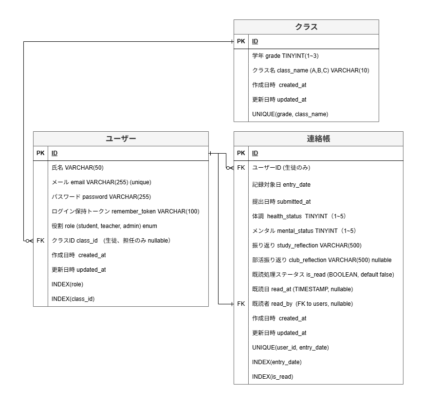

# ER図（Entity Relationship Diagram）

## データベース構造

連絡帳管理システムのデータベース構造を以下に示します。

---

## テーブル一覧

| テーブル名 | 論理名 | 説明 |
|----------|-------|------|
| users | ユーザー | 生徒、担任、管理者の情報 |
| classes | クラス | 学年・クラス情報 |
| entries | 連絡帳 | 生徒の連絡帳記録 |

---

## テーブル詳細

### users（ユーザー）

**概要**: 生徒、担任、管理者の情報を管理

| カラム名 | データ型 | NULL | デフォルト | 制約 | 説明 |
|---------|---------|------|----------|------|------|
| id | BIGINT UNSIGNED | NO | AUTO_INCREMENT | PK | ユーザーID |
| name | VARCHAR(50) | NO | - | - | 氏名 |
| email | VARCHAR(255) | NO | - | UNIQUE | メールアドレス（ログインID） |
| password | VARCHAR(255) | NO | - | - | パスワード（ハッシュ化） |
| role | ENUM('student','teacher','admin') | NO | 'student' | - | 役割 |
| class_id | BIGINT UNSIGNED | YES | NULL | FK | 所属クラスID（生徒・担任のみ） |
| remember_token | VARCHAR(100) | YES | NULL | - | ログイン保持トークン |
| created_at | TIMESTAMP | NO | CURRENT_TIMESTAMP | - | 作成日時 |
| updated_at | TIMESTAMP | NO | CURRENT_TIMESTAMP | - | 更新日時 |

**注意事項**:
- `email_verified_at` はLaravel標準で存在するが、本システムでは使用しない（管理者がユーザーを作成するため、メール認証不要）
- `remember_token` は「ログイン状態を保持する」機能で使用

**インデックス**:
- PRIMARY KEY: `id`
- UNIQUE: `email`
- INDEX: `role`
- INDEX: `class_id`

**外部キー**:
- `class_id` → `classes(id)` ON DELETE SET NULL

---

### classes（クラス）

**概要**: 学年・クラス情報を管理

| カラム名 | データ型 | NULL | 制約 | 説明 |
|---------|---------|------|------|------|
| id | BIGINT UNSIGNED | NO | PK | クラスID |
| grade | TINYINT | NO | - | 学年（1〜3） |
| class_name | VARCHAR(10) | NO | - | クラス名（A, B, C） |
| created_at | TIMESTAMP | NO | - | 作成日時 |
| updated_at | TIMESTAMP | NO | - | 更新日時 |

**インデックス**:
- PRIMARY KEY: `id`
- UNIQUE: `(grade, class_name)`

**ビジネスルール**:
- 同じ学年に同じクラス名は存在しない

---

### entries（連絡帳）

**概要**: 生徒の連絡帳記録を管理

| カラム名 | データ型 | NULL | 制約 | 説明 |
|---------|---------|------|------|------|
| id | BIGINT UNSIGNED | NO | PK | 記録ID |
| user_id | BIGINT UNSIGNED | NO | FK | 生徒ID |
| entry_date | DATE | NO | - | 記録対象日（前登校日） |
| submitted_at | TIMESTAMP | NO | - | 提出日時 |
| health_status | TINYINT | NO | CHECK(1-5) | 体調（1〜5） |
| mental_status | TINYINT | NO | CHECK(1-5) | メンタル（1〜5） |
| study_reflection | VARCHAR(500) | NO | - | 授業振り返り |
| club_reflection | VARCHAR(500) | YES | - | 部活振り返り |
| is_read | BOOLEAN | NO | DEFAULT FALSE | 既読フラグ |
| read_at | TIMESTAMP | YES | - | 既読日時 |
| read_by | BIGINT UNSIGNED | YES | FK | 既読処理した教師ID |
| created_at | TIMESTAMP | NO | - | 作成日時 |
| updated_at | TIMESTAMP | NO | - | 更新日時 |

**インデックス**:
- PRIMARY KEY: `id`
- UNIQUE: `(user_id, entry_date)`
- INDEX: `entry_date`
- INDEX: `is_read`

**外部キー**:
- `user_id` → `users(id)` ON DELETE CASCADE
- `read_by` → `users(id)` ON DELETE SET NULL

**ビジネスルール**:
- 同じ生徒が同じ記録対象日の記録を複数持たない

---

## リレーション

### 1. users ← classes（多対一）
- 1つのクラスに複数のユーザー（生徒・担任）が所属
- 管理者は `class_id = NULL`

### 2. entries ← users（多対一）
- 1人の生徒が複数の連絡帳記録を持つ
- `entries.user_id` → `users.id`

### 3. entries ← users（既読者）（多対一）
- 1人の教師が複数の連絡帳を既読処理
- `entries.read_by` → `users.id`

---

## データ制約

### ユニーク制約
1. `users.email`: メールアドレスは一意
2. `classes.(grade, class_name)`: 同じ学年に同じクラス名は存在しない
3. `entries.(user_id, entry_date)`: 同じ生徒が同じ日付の記録を複数持たない

### チェック制約
1. `entries.health_status`: 1〜5の範囲
2. `entries.mental_status`: 1〜5の範囲

### カスケード削除
- ユーザーが削除されると、そのユーザーの連絡帳も削除される
- クラスが削除されても、ユーザーは削除されない（class_idがNULLになる）

---

## マイグレーション実行順序

1. `create_classes_table`（最初）
2. `add_custom_fields_to_users_table`（Breeze標準を拡張）
3. `create_entries_table`（最後）

