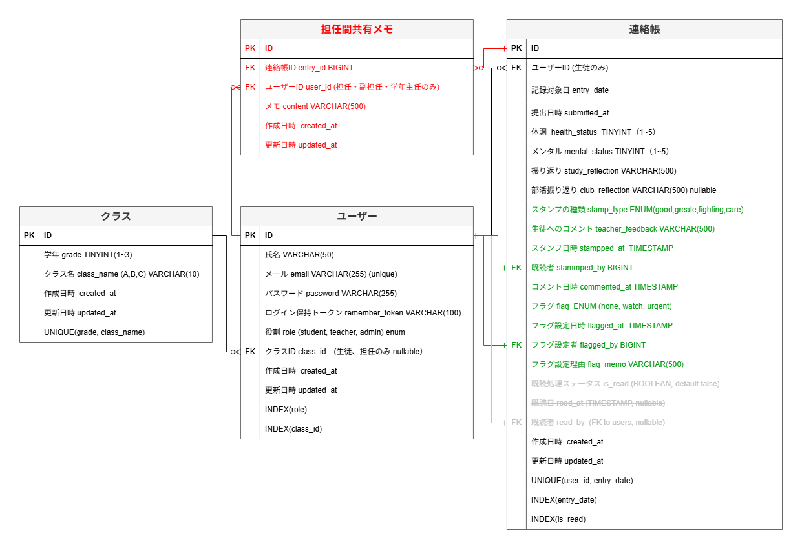
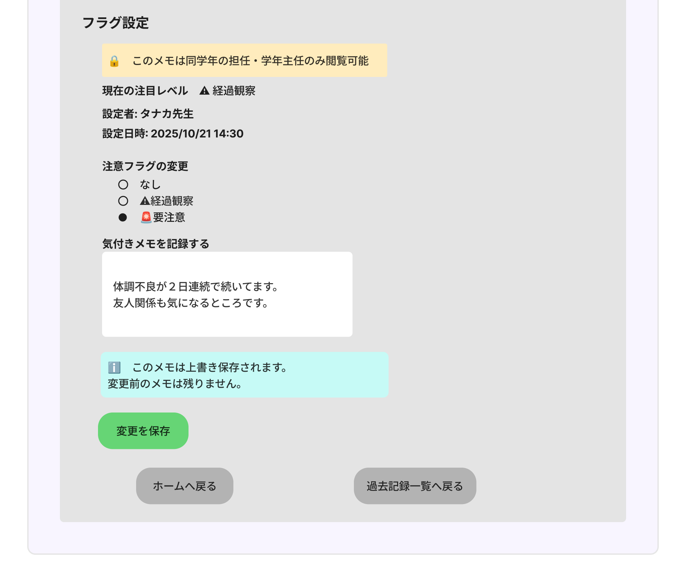
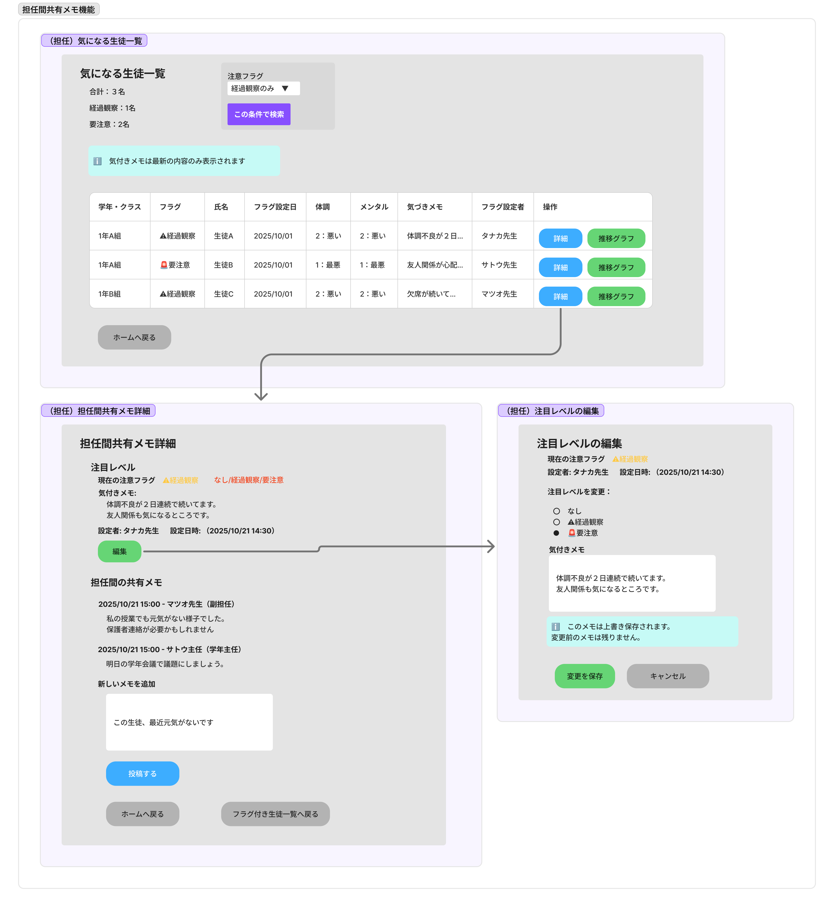

# 連絡帳管理システム PoC プレゼンテーション資料

## 1. プロジェクト概要

### 1.1 プロジェクト名
**連絡帳管理システム PoC（Proof of Concept）**

### 1.2 目的
紙の連絡帳が抱えていた以下の課題を解決するため、デジタル化した連絡帳管理システムのプロトタイプを開発する。

**従来の課題**:
- 取り扱いの煩雑さ
- 提出漏れチェックの困難さ
- フォーマットのばらつき

---

### 1.3 対象ユーザー

| ロール | 主な役割 |
|--------|---------|
| **生徒** | 連絡帳の登録・閲覧 |
| **担任** | 生徒の連絡帳確認・既読処理 |
| **副担任** | 担任と同じ権限で担当クラスをサポート ※課題２で追加 |　
| **管理者** | ユーザー・クラス管理 |

---

### 1.4 成果物の概要

**デプロイURL**: https://jpt-intern-app.fitcloset.net

**システム規模**:
- 画面数: 17画面（認証1 + 生徒4 + 担任5 + 管理者7）※課題２でグラフ画面2つを追加
- ユーザー数: 193名（管理者1 + 担任6 + 副担任6 + 生徒180）※課題２で副担任ロールを追加
- クラス数: 6クラス（1〜3年各2クラス）
- テストデータ: 連絡帳約550件

**開発環境**:
- フレームワーク: Laravel 10.x
- データベース: MySQL 8.4
- インフラ: AWS（EC2, RDS, ALB, Route53, ACM）

---

## 2. 機能要件

### 2.1 生徒機能
- 連絡帳の登録（体調、メンタル、授業・部活振り返り）
- 過去記録の閲覧
- 既読後の記録は編集不可

### 2.2 担任機能
- 提出された連絡帳の閲覧
- 既読処理（「いいね！」スタンプ）※課題１では1種類、課題２で複数種類に拡張
- 1日の提出状況把握 ※課題２で注意が必要な生徒リストを追加
- 過去記録の確認 ※課題２で個別生徒・クラス全体の統計グラフを追加

### 2.3 管理者機能
- 生徒・担任・副担任アカウントの作成 ※課題２で副担任ロールを追加
- クラス・学年の管理

---

### 2.4 画面遷移図

システム全体の画面遷移を以下に示します。 
※「課題１」時点の仕様になります。

*ロール別に色分けし、主要な画面遷移フローを図示*

---

## 3. 明記されていない要件への対応

Web課題の資料から読み取れなかった要件について、以下の仮説を立てて実装を進めました。

| 項目 | 仮説内容 | 理由・根拠 |
|------|---------|-----------|
| **連絡帳フォーマット** | 「体調」「メンタル」「授業振り返り」「部活振り返り」の4項目に統一 | 統一フォーマットにより、データの集計・分析が容易になる |
| **認証方式** | メールアドレス + パスワード認証 | 「学校よりPC配布」とあり、全員がメールアドレスを所持している前提 |
| **記録対象日** | 提出日の前登校日をデフォルト設定 ただし生徒は日付選択可能 | ・提出タイミングは翌登校日を想定 ・当日の授業終了後に記入するケースも考慮 |
| **担任の担当** | 1学年1クラスのみ担当（掛け持ちなし） | 業務負荷の観点から現実的な制約 |
| **ロール割り当て** | 1ユーザー1ロール（掛け持ちなし） | 権限管理をシンプルに保つため |
| **管理者の役割** | ユーザー管理・クラス管理に特化 連絡帳は閲覧不可 | 権限を明確に分離し、セキュリティを強化 |
| **スタンプの種類** | 1種類のみに限定 | 必須機能（MVP）「既読処理ができる事」を優先 |

また、各機能のロールごとの権限についても整理しました。
| 機能 | 生徒 | 担任 | 管理者 |
|------|:----:|:----:|:------:|
| **連絡帳の閲覧** | ✅ 自分のみ | ✅ 担当クラス | ❌ |
| **連絡帳の作成・編集** | ✅ | ❌ | ❌ |
| **既読処理（スタンプ）** | ❌ | ✅ | ❌ |
| **ユーザー管理** | ❌ | ❌ | ✅ |
| **学年・クラス管理** | ❌ | ❌ | ✅ |
| **パスワード更新** | ✅ 自分のみ | ✅ 自分のみ | ✅ 全ユーザー |
---

## 4. 課題１の工夫点・アピール

### 4.1 要件達成度

**必須要件の充足状況**: ✅ 100%達成

| 要件カテゴリ | 実装状況 |
|------------|---------|
| **生徒機能** | ✅ 連絡帳登録・閲覧・編集（未既読のみ） |
| **担任機能** | ✅ 連絡帳閲覧・既読処理・提出状況把握・過去記録閲覧 |
| **管理者機能** | ✅ ユーザー管理・クラス管理・パスワードリセット |
| **認証** | ✅ メールアドレス + パスワード認証 |
| **記録対象日** | ✅ 前登校日の自動算出（土日除外） |
| **既読後編集不可** | ✅ 実装済み |

**追加実装機能**:
- 絞り込み検索機能（生徒名、日付、既読ステータス）
- 統計情報表示（提出状況サマリー）

---

### 4.2 技術スタックと選定理由

#### 使用技術一覧

| カテゴリ | 技術 |
|---------|------|
| **フロントエンド** | HTML / CSS / Tailwind CSS / JavaScript |
| **バックエンド** | PHP 8.3 / Laravel 10 |
| **データベース** | MySQL 8.4 |
| **認証** | Laravel Breeze |
| **開発環境** | MAMP 5.0.6 / Apache |
| **開発ツール** | Node.js (npmのみ使用) / Composer / Vite |
| **インフラ** | AWS (VPC, Route53, ELB, ACM, EC2, RDS, S3) |
| **その他** | Figma（画面遷移図・ロゴ作成） |

#### 主要技術の選定理由

| 技術 | 選定理由 |
|------|---------|
| **Laravel 10.x** | ・MVCアーキテクチャで保守性が高い ・Laravel Breezeで認証機能を迅速に実装 ・Eloquent ORMでデータベース操作が容易 |
| **MySQL 8.4** | ・トランザクション対応でデータ整合性を保証 ・多くの開発者に馴染みがあり、学習コストが低い |
| **AWS** | ・既存ポートフォリオのリソース活用で工数削減 ・ACMによるSSL証明書の自動更新 |
| **Tailwind CSS** | ・Laravel Breezeに標準搭載 ・ユーティリティファーストで開発効率が高い |

---

### 4.3 セキュリティへの配慮

**通信セキュリティ**:
- ✅ HTTPS通信（SSL/TLS）
- ✅ ACM証明書による自動更新
- ✅ HTTP→HTTPSリダイレクト

**認証・認可**:
- ✅ Laravel Breezeによるセッションベース認証
- ✅ パスワードハッシュ化（bcrypt）
- ✅ ロールベースアクセス制御
- ✅ CSRF保護（Laravel標準）

**インフラセキュリティ**:
- ✅ RDSをPrivate Subnetに配置（外部アクセス不可）
- ✅ セキュリティグループによる厳密なアクセス制御
- ✅ SSH接続は管理者IPのみに制限

**アプリケーションセキュリティ**:
- ✅ SQLインジェクション対策（Eloquent ORM使用）
- ✅ バリデーション処理の徹底
- ✅ 本番環境でAPP_DEBUG=false設定

---

### 4.4 データベース設計の工夫

#### 日付の明確化
- 連絡帳テーブルに「提出日」「記録対象日」カラムを設定
- 現行の連絡帳では日付が不明瞭だった問題を解決

#### 体調・メンタルの数値化
- 良好～最悪まで1～5の数値で表現
- 将来的なグラフ化を考慮

#### ユニーク制約の設定
- **連絡帳**: 生徒は同じ記録対象日の連絡帳を複数登録できない
- **クラス**: 同学年内で同じクラス名を複数登録できない

---

### 4.5 機能実装の工夫

#### 共通機能

**今日の日付表示（ヘッダー）**
- 連絡帳の記録対象日との混同を防止

**ログインユーザー表示**
- 氏名・ロールをヘッダーに明示

**プロフィール画面**
- ログインユーザー情報の確認
- パスワード更新機能

**連絡帳の絞り込み**
- 生徒・担任ロールで連絡帳を日付・氏名・既読状況などで検索可能

**シンプルなUI**
- 必要な情報のみを表示

---

#### 生徒ロール特有の機能

**本日の連絡帳の提出状況表示**
- 一目で提出状況が分かる視覚的表示
  - 🟡 黄色：未提出
  - 🟢 緑：提出済み

**体調・メンタルの入力**
- 数値選択（良好～最悪）
- 色分け表示
- 将来的な推移グラフ化を考慮

---

#### 担任ロール特有の機能

**当日の提出状況の統計表示**
- 1日の生徒全員の状況を把握
- 「提出済み」「既読済み」「未提出」を色分け表示

**絞り込み検索機能**
- 記録対象日で検索
- 既読ステータスで検索
- 生徒名でソート

---

#### 管理者ロール特有の機能

**統計データ表示**
- 全クラス数
- 全担任数
- 全生徒数
- ホーム画面で一覧表示

**ユーザー検索機能**
- ロールで検索
- 氏名で検索
- 学年・クラスで検索

**パスワードリセット機能**
- ユーザーがパスワードを忘れた場合に対応
- リセット後、一度だけ画面表示（セキュリティ考慮）

**学年・クラス管理機能**
- クラス新規登録
- クラス一覧表示（担任・生徒数を表示）
- 担任の割り当て機能

**ユーザー作成機能**
- ロール割り当て
- 学年・クラス割り当て

---

### 4.6 開発プロセスの工夫

#### 使用ツール
開発プロセスの効率化のため、以下のツールを活用しました。

- **NotebookLM**: 課題要件の整理
- **Figma**: 画面遷移図の作成、要件の視覚化
- **Claude Code**: 要件定義書(project-management)の作成、実装作業の効率化 ※project-managementはclaude codeによる実装効率化目的で作成したものであり、課題提出資料として含めておりません
- **Claude AI / ChatGPT**: 技術的な問題解決の補助

#### インフラ構築の最適化
- **AWS**
  - 既存ポートフォリオのリソース（VPC・Subnet）を共用
  - EC2・RDS・ELBのみ新設
  - 構築期間の短縮を実現

#### ブランチ運用・コミット管理
個人開発ながらチーム開発を想定し、GitHub Flowをベースにブランチ運用・コミットメッセージのルール化を行いました。

**ブランチ戦略**:
- 機能別にブランチを作成（`feature/`, `fix/`, `ui/`等）
- 機能完成後にmainブランチへマージ
- 課題２の追加実装では開発用ブランチ(development)を準備し、機能完成後にmainブランチにマージ
- コミットメッセージは英語で統一し、プレフィックスを使用（`feat:`, `fix:`, `docs:`等）

---

## 5. 課題２のプレゼンテーション
課題１の仕様に対して、より現場で使いやすくするため、下記の項目を提案いたします。「✅実装」となっている項目は追加実装を施しています。

### 5.1 提案項目一覧と拡張版ER図
| No | 提案 | 目的 | 技術実装方法 | UI変更 | DB変更 | 実装 |
|----|------|------|------------|--------|--------|:----:|
| **No1: データ可視化** |
| 1-1 | 個別生徒の推移グラフ | 生徒の状態変化を時系列で把握、早期異変検知 | Chart.js + Laravelコントローラーで集計 + 期間指定機能 | ✅ 追加 | ❌ なし | ✅ 実装 |
| 1-2 | クラス全体の統計グラフ | 受験期・テスト期の全体傾向把握 | Chart.js（グラフ描画） + Laravel（データ集計） + 期間指定機能 | ✅ 追加 | ❌ なし | ✅ 実装 |
| 1-3 | 担任ダッシュボード強化 | 注意が必要な生徒リストの表示 | Eloquent where条件(2以下) + Blade | ✅ 修正 | ❌ なし | ✅ 実装 |
| **No2: 情報共有・フィードバック** |
| 2-1 | 気になる生徒のフラグ機能 | 担任間でタイムリーな情報共有 | 連絡帳テーブルにflagカラム追加 | ✅ 追加 | ✅ カラム追加 | 📄 提案のみ |
| 2-2 | 複数スタンプ対応 | より豊かなフィードバック表現 | stamp_typeカラム追加、既存is_read併用 | ✅ 修正 | ✅ カラム追加 | ✅ 実装 |
| 2-3 | 担任コメント機能（生徒へ） | 生徒へのアドバイスやフィードバック等 | teacher_feedbackカラム追加 | ✅ 追加 | ✅ カラム追加 | ✅ 実装 |
| 2-4 | 担任間共有メモ機能 | 担任間の詳細な情報共有 | teacher_commentsテーブル作成 | ✅ 追加 | ✅ テーブル追加 | 📄 提案のみ |
| **No3: 役割拡張** |
| 3-1 | 副担任ロール追加 | 複数教師での見守り | usersテーブルroleカラム値追加 | ✅ 追加 | ✅ カラム修正 | ✅ 実装 |
| 3-2 | 学年主任ロール追加 | 学年全体の把握、クラス比較 | ロール追加 + 権限管理クラス（誰が何を見られるか制御） | ✅ 追加 | ✅ カラム修正 | 📄 提案のみ |
| **No4: アラート機能** |
| 4-1 | 体調異常の自動検知 | 早期の異変検知 | 毎日自動チェック + システム内通知（ダッシュボード表示） | ✅ 追加 | ✅ テーブル追加 | 📄 提案のみ |
| 4-2 | 提出率低下アラート | クラス単位の問題検知 | 集計バッチ + 閾値判定 | ✅ 追加 | ❌ なし | 📄 提案のみ |
| **No5: モバイル対応** |
| 5-1 | レスポンシブ改善 | スマホでの操作性向上 | Tailwind CSSブレークポイント調整 + Chart.jsグラフの高さ固定 | ✅ 修正 | ❌ なし | ✅ 実装 |

#### 拡張版ER図

下記に提案する追加要件に伴い、拡張版のER図を示します。
- ※緑色のカラムは実装済み
- ※赤色のテーブル・カラムは提案のみ
- ※グレー色のカラムは廃止済み

---

### 5.2 実装済み機能の詳細

#### 使用した追加技術

**Chart.js**:
- **目的**: 生徒の体調・メンタルの推移をグラフで可視化
- **選定理由**:
  - 軽量でレスポンシブ対応
  - 豊富なグラフ種類と簡潔なAPI
- **実装内容**:
  - 個別生徒の体調・メンタル推移グラフ（折れ線グラフ）
  - クラス全体の統計グラフ（折れ線グラフ + 棒グラフ）
  - 期間指定機能（開始日・終了日の指定）
  - スマホ表示対応（高さ固定で視認性向上）

#### データベース拡張（実装済み）

**複数スタンプ対応**:
- `stamp_type`カラム追加（ENUM: good, great, fighting, care）
- 既存の`is_read`カラムと併用

**教師フィードバック**:
- `teacher_feedback`カラム追加（TEXT型）
- `feedback_by`カラム追加（教師ID、外部キー）
- コメント者の名前を表示可能

**副担任ロール**:
- `users`テーブルの`role`カラムにsub_teacher値を追加
- 担任と同じ権限でルーティング・ビューを共有

#### 実装機能サマリー

**実装した機能の一覧**:
- **注意が必要な生徒リスト**: 体調またはメンタルが2以下の生徒を自動抽出して黄色の警告ボックスで表示
- **個別生徒の推移グラフ**: 生徒ごとの体調・メンタルを時系列グラフで表示、期間指定が可能
- **クラス全体の統計グラフ**: クラス全体の平均値推移と提出数を可視化、期間指定が可能
- **複数スタンプ対応**: 4種類のスタンプから選択可能（👍いいね / ⭐素晴らしい / 💪頑張ろう / 💙気にかけてるよ）
- **コメントフィードバック**: 生徒への個別メッセージを記入可能、コメント者の名前も表示
- **副担任ロール**: 担任と同じ権限で担当クラスをサポート、管理者がユーザー作成・編集可能
- **レスポンシブ改善**: グラフのスマホ表示を最適化（高さ固定で視認性向上）
- **ブラウザキャッシュ問題の修正**: キャッシュ制御メタタグ追加、ログイン済みリダイレクト修正

---

### 5.3 未実装機能の提案

時間制約により以下の機能は提案のみとなりました。データベース準備は完了しており、将来的な実装が可能です。

#### 気になる生徒のフラグ設定機能（提案）

下記に担任の連絡帳詳細画面における「気になる生徒のフラグ設定機能」の画面UI図を提案します。

**この機能の特徴**:
- 担任・副担任ロールが連絡帳閲覧時に気づきメモを記録できる
- 閲覧権限・編集権限は担任・副担任・学年主任のみ
- ユースケースで、体調・メンタルが２以下の場合に注意フラグを設定可能
- 注意フラグが設定された生徒は、別途「気になる生徒一覧」画面で一覧表示

**データベース準備状況**:
- `flag`カラム追加（ENUM: none, watch, urgent）
- `flagged_at`カラム追加（TIMESTAMP）
- `flagged_by`カラム追加（教師ID、外部キー）
- `flag_memo`カラム追加（TEXT型）

#### 担任間共有メモ機能（提案）

下記に担任間共有メモ機能における画面UI図を提案します。

**この機能の特徴**:
- 担任・副担任・学年主任ロールが閲覧可能
- 「気になる生徒一覧」画面でフラグ付き生徒を確認
- 担任間共有メモ詳細画面でスレッド形式でメモを残せる
- 新規で担任間共有メモテーブル（teacher_comments）を新設（提案）

#### 学年主任ロール（提案）

- `users`テーブルの`role`カラムにgrade_supervisorを追加
- 学年全体の生徒データ閲覧権限
- 学年全体の統計グラフ表示
- クラス間の比較機能

#### その他の提案機能

**アラート機能**:
- 体調異常の自動検知（毎日自動チェック + システム内通知）
- 提出率低下アラート（集計バッチ + 閾値判定）

---

### 5.4 権限マトリクス

| 機能 | 生徒 | 担任 | 副担任 | 学年主任 | 管理者 |
|------|:----:|:----:|:------:|:--------:|:------:|
| 連絡帳閲覧 | ✅ 自分のみ | ✅ 担当クラス | ✅ 担当クラス | 📄 学年全体 | ❌ |
| 連絡帳作成・編集 | ✅ 自分のみ | ❌ | ❌ | ❌ | ❌ |
| 既読スタンプ | ❌ | ✅ | ✅ | ❌ | ❌ |
| 複数スタンプ | ❌ | ✅ | ✅ | ❌ | ❌ |
| 生徒へのコメント | ❌ | ✅ | ✅ | ❌ | ❌ |
| フラグ設定 | ❌ | 📄 提案 | 📄 提案 | 📄 提案 | ❌ |
| フラグメモ | ❌ | 📄 提案 | 📄 提案 | 📄 提案 | ❌ |
| 担任間共有メモ | ❌ | 📄 提案 | 📄 提案 | 📄 提案 | ❌ |
| 個別推移グラフ | ❌ | ✅ 担当 | ✅ 担当 | 📄 学年 | ❌ |
| クラス統計グラフ | ❌ | ✅ 担当 | ✅ 担当 | 📄 学年 | ❌ |
| ユーザー管理 | ❌ | ❌ | ❌ | ❌ | ✅ |

※ ✅: 実装済み / 📄: 提案のみ

---

## 6. 課題・インターンの感想

### 6.1 技術的な課題

**AWSインフラ構築の難しさ**
- 当初の想定：10時間
- 実際の所要時間：17時間
- エラー対応に予想以上の時間を要した

### 6.2 プロジェクト管理の学び

**100時間という制約の中での取り組み**
- タスクの優先順位付け
- MVP（Minimum Viable Product）を意識した開発
- スケジュール管理の重要性

**開発フェーズ**:
1. 要件整理
2. 画面遷移図・ER図の作成
3. 実装
4. デプロイ
5. アウトプット資料作成

### 6.3 反省点

**優先度の低いタスクへの過度な時間投資**
- 特にUIやデプロイ手順のドキュメント作成
- ASD（アスペルガー症候群）の傾向によるこだわりの強さが影響
- 今後は優先度管理をより意識する必要がある

---
